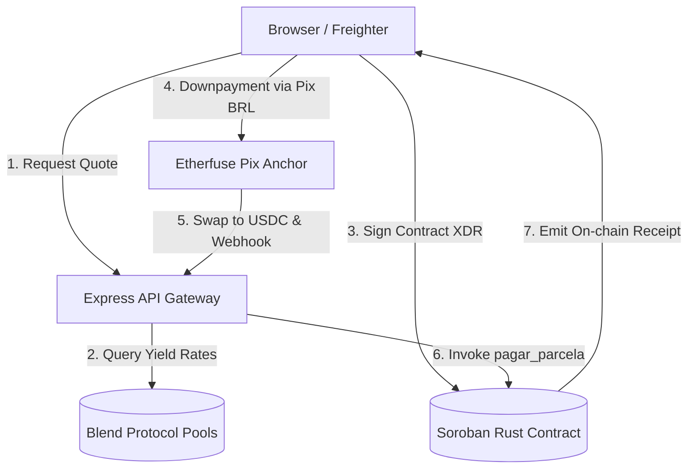
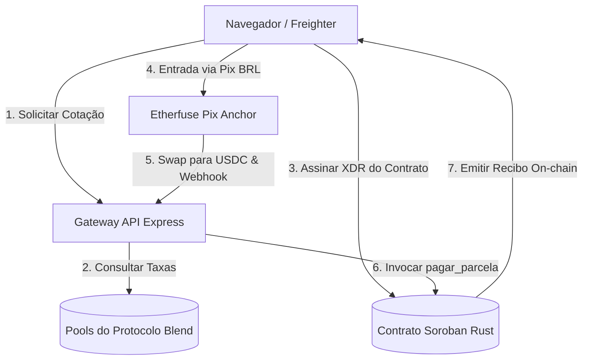

[🇺🇸 English](#english) | [🇧🇷 Português](#português)

---

<a id="english"></a>
# SyloPay — System Context & Architecture

SyloPay is a **decentralized Buy Now, Pay Later (BNPL) protocol** built on the **Stellar** blockchain using **Soroban Smart Contracts**. It enables e-commerce merchants to offer flexible, transparent installment plans to customers while receiving the full transaction amount instantly. The ecosystem unifies the financial ledger in USDC, with seamless BRL on-ramping via sandboxed Pix API gateways.

---

## 🏗 System Architecture Flow

The following diagram illustrates how the Customer, Freighter wallet, Gateway backend, and Stellar Horizon networks interact:



---

## 🚀 Production Deployments

*   **Frontend web app**: [sylopay-bnpl.vercel.app](https://sylopay-bnpl.vercel.app)
*   **Backend gateway REST API**: [backend-cpanel.vercel.app](https://backend-cpanel.vercel.app/health)
*   **Soroban Contract Explorer (Testnet)**: [Stellar Expert](https://stellar.expert/explorer/testnet/contract/CBY3H6BBUJ64H3QGSDMEQVZU3GKXV4WRE7V7X62PUFXNWYAHI4CCWTXH)

---

## 🗂 Workspace Layout

```
sylopay/
├── CONTEXT.md                   # This detailed system context & architecture specification
├── README.md                    # Installation manual and developer quickstart guide
├── .env.example                 # Standard environment profile template
├── package.json                 # Global automation task scripts
│
├── docs/                        # Docusaurus Technical Specification Portal (React + TS)
│
├── scripts/                     # Node.js CLI dev-ops utilities
│   ├── setup-stellar.js         # Geração de keypairs Stellar e Friendbot funding
│   ├── register-webhook.js      # Registering and configuring Etherfuse HMAC webhooks
│   └── test-webhook.js          # Local simulated Pix payment webhook dispatcher
│
├── frontend/                    # SPA React + Vite + TypeScript (port 3001)
│   ├── public/                  # High-res item catalog images and branding logos
│   └── src/
│       ├── App.tsx              # Router entrypoint
│       ├── hooks/useBNPL.tsx    # Hook and global context coordinating checkout state
│       ├── pages/               # Multi-step views (Checkout, Quotation, Contract, Dashboard)
│       ├── components/          # Reusable UI primitives
│       └── services/            # Axios API wrappers and DeFi fetchers
│
├── backend-cpanel/              # Express API Server gateway (port 3000)
│   └── src/
│       ├── app-hybrid.ts        # Production endpoint integrated with Soroban RPC and Horizon
│       ├── app-lite.ts          # Offline sandbox demo server with mocked data
│       ├── swagger.ts           # OpenAPI/Swagger configurations
│       └── services/
│           ├── storage.ts       # Simple JSON database storage (contracts.json)
│           ├── soroban.ts       # Stellar Soroban RPC client methods
│           └── etherfuse.ts     # FX conversions and Pix sandboxed orders
│
└── contracts/
    └── sylopay_bnpl/            # Soroban Smart Contract source code in Rust
        ├── Cargo.toml
        ├── src/
        │   ├── lib.rs           # Modular entrypoint containing clean #[contractimpl] functions
        │   ├── types.rs         # Storage keys, structs, and enums #[contracttype]
        │   ├── utils.rs         # Shared helper functions and unique ID generators
        │   └── test.rs          # Isolated unit test suite
        └── docs/                # Interactive mdBook digital guide
```

---

## 🛠 Tech Stack

*   **Frontend**: React 18, Vite 5, TypeScript 5, Tailwind CSS 3.
*   **Backend**: Node.js, Express 4, TypeScript 5, OpenAPI / Swagger (Deployed to Vercel).
*   **Smart Contracts**: Rust (`soroban-sdk v22`), Cargo.
*   **Stablecoin**: USDC (Testnet).
*   **On-Ramp Anchor (Pix)**: Etherfuse Sandbox FX API + HMAC secure cryptographic webhooks.
*   **Web3 Wallet**: `@stellar/freighter-api` (Freighter Wallet). Required browser extension — `ContractPage` guards with a redirect to [freighter.app](https://www.freighter.app) if not installed.

---

## 📝 Soroban Smart Contract Specifications

The SyloPay BNPL on-chain core is written in Rust, refactored into a comment-free, modular architecture designed for security and gas optimization.

*   **Contract ID (Testnet)**: `CBY3H6BBUJ64H3QGSDMEQVZU3GKXV4WRE7V7X62PUFXNWYAHI4CCWTXH`
*   **USDC Token Address (Testnet)**: `GBBD47IF6LWK7P7MDEVSCWR7DPUWV3NY3DTQEVFL4NAT4AQH3ZLLFLA5`

### Exported Functions (`lib.rs`)

#### State-Mutating Endpoints
*   `initialize(env: Env, admin: Address)`: Establishes contract administrator and boots the counter to zero.
*   `criar_contrato(env: Env, merchant: Address, cliente: Address, valor_total: i128, num_parcelas: u32) -> String`: Registers a new structured BNPL contract on-chain. Staggers 30-day billing cycles, mapping ledger records into persistent storage.
*   `pagar_parcela(env: Env, contrato_id: String, numero_parcela: u32, tx_hash: String)`: Confirms a single installment settlement, writing the transaction hash onto the ledger record. **Gasless Fee sponsorship**: This function uses `admin.require_auth()` instead of `client.require_auth()`, letting the backend administrator sign the transactions on behalf of the customer, paying the network fees (XLM) while the customer only pays the USDC principal.
*   `marcar_inadimplente(env: Env, contrato_id: String)`: Allows only the administrator account to flag delinquent agreements with overdue installments.

#### Read-Only Endpoints
*   `status_contrato(env: Env, contrato_id: String) -> ContratoBNPL`: Returns structural ledger data for the specified contract ID.
*   `listar_contratos_cliente(env: Env, cliente: Address) -> Vec<String>`: Returns a vector of contract IDs created by the user.
*   `obter_admin(env: Env) -> Address`: Returns the active administrator address.
*   `total_contratos(env: Env) -> u32`: Returns total registered contract counters.

---

## 💰 Fee Model

All fees are computed server-side in `/api/quotation` and reflected precisely in every step of the frontend:

| Fee | Rate | Who Pays | Applied To |
| :--- | :--- | :--- | :--- |
| **Consumer Interest** | `Blend rate × 0.8 + 0.5%` | Customer | `totalAmount`, `installmentAmount` in quotation |
| **SyloPay Flat Fee** | `USDC 0.25` per contract | Customer | Shown as a line item in Order Summary |
| **Merchant Fee** | `3.5%` | Merchant | Settled off-chain by merchant acceptance |
| **Network Fee (XLM)** | ~`0.01 XLM` | SyloPay Admin | Sponsored by `SOROBAN_ADMIN_SECRET` via `admin.require_auth()` |

**QuotationPage formula** (backend `/api/quotation`):
```
consumerRate = blendBorrowRate × 0.8 + 0.5%
interestAmount = principal × (consumerRate / 100)
totalAmount = principal + interestAmount
installmentAmount = totalAmount / numberOfInstallments
```

**ContractPage Order Summary** shows each fee as an individual row:
- Product Price (converted BRL → USDC at `/ 5.7`)
- Interest Rate (APR)
- Interest Amount (`+USDC X.XX`)
- SyloPay Fee (`USDC 0.25`)
- Each Payment
- **Total You'll Pay**

---

## 📡 Gateway API Server Endpoints (backend-cpanel)


### Infrastructure & Stellar
*   `GET /health`: Operational health status.
*   `GET /api/stellar/health`: Active Horizon testnet node synchronization checks.
*   `POST /api/stellar/create-account`: Auto-funds a simulated Testnet keypair using Stellar Friendbot.
*   `GET /api/stellar/account/:publicKey`: Queries active token balances (XLM/USDC).
*   `POST /api/stellar/create-trustline`: Configures trustlines dynamically for USDC.

### FX Quotes & Orders (Etherfuse)
*   `POST /api/etherfuse/quote-onramp`: Fetches conversion fees and Pix on-ramp quotes.
*   `POST /api/etherfuse/order`: Dispatches sandboxed Pix order keys and Pix QR Codes. Provisions a bank account via `/ramp/bank-account` first to ensure sandboxed proxy requirements are met.
*   `GET /api/etherfuse/order/:id`: Queries transaction progress on the sandbox anchor.

### Soroban Ledger Procedures
*   `POST /api/soroban/prepare-contract`: Compiles unsigned transaction envelopes (XDR) for Freighter.
*   `POST /api/soroban/submit-contract`: Submits Freighter signed envelopes to Soroban.
*   `POST /api/soroban/prepare-payment`: Generates unsigned payment envelopes for direct USDC settlements.
*   `POST /api/soroban/submit-transaction`: Publishes USDC billing payments to Horizon Testnet.
*   `GET /api/soroban/contracts/cliente/:publicKey`: Aggregates active contracts from local memory and on-chain Soroban.

### HMAC Cryptographic Webhooks
*   `POST /webhook/etherfuse`: Validates sandbox Pix deposits via HMAC signatures, executes off-chain to on-chain conversions, and triggers the `pagar_parcela` Soroban contract invocation on-chain automatically.

---

## 🎯 Integrations & Advanced Protocols

1.  **DeFi Integrations**: Queries simulated Blend Protocol pools borrow rates (1.5% to 3.5%). Consumer rate = `borrowRate × 0.8 + 0.5%` SyloPay margin. The `totalAmount` and `installmentAmount` returned by `/api/quotation` already include the compounded interest — no hidden fees.
2.  **Freighter Wallet Guard**: `ContractPage` calls `isConnected()` from `@stellar/freighter-api` on mount. If the extension is absent, a branded loading screen is shown and the user is immediately redirected to [https://www.freighter.app](https://www.freighter.app). Prevents any broken wallet connection UI.
3.  **HTTP 402 / x402 Specification**: Supports the Web Monetization standard. External marketplaces can resolve merchant vaults dynamically via standardized HTTP headers.
4.  **USDC-Only Checkout Experience**: Eliminates checkout pricing ambiguity. Converts all catalog pricing from BRL to USDC at a fixed `5.7` rate and calculates all installment amounts in USDC.

---
---

<a id="português"></a>
# SyloPay — Contexto do Sistema e Arquitetura

SyloPay é um **protocolo descentralizado de Compre Agora, Pague Depois (BNPL)** construído na blockchain **Stellar** utilizando **Smart Contracts Soroban**. Ele permite que lojistas de e-commerce ofereçam planos de parcelamento flexíveis e transparentes aos clientes, enquanto recebem o valor total da transação instantaneamente. O ecossistema unifica o livro-razão financeiro em USDC, com conversão via Pix BRL (on-ramp) em ambiente sandbox de gateways de API.

---

## 🏗 Fluxo da Arquitetura do Sistema

O diagrama a seguir ilustra como o Cliente, a carteira Freighter, o backend Gateway e as redes Stellar Horizon interagem:



---

## 🚀 Implantações em Produção

*   **Web app Frontend**: [sylopay-bnpl.vercel.app](https://sylopay-bnpl.vercel.app)
*   **API REST Gateway (Backend)**: [backend-cpanel.vercel.app](https://backend-cpanel.vercel.app/health)
*   **Soroban Contract Explorer (Testnet)**: [Stellar Expert](https://stellar.expert/explorer/testnet/contract/CBY3H6BBUJ64H3QGSDMEQVZU3GKXV4WRE7V7X62PUFXNWYAHI4CCWTXH)

---

## 🗂 Estrutura do Workspace

```
sylopay/
├── CONTEXT.md                   # Esta especificação detalhada de contexto do sistema e arquitetura
├── README.md                    # Manual de instalação e guia rápido para desenvolvedores
├── .env.example                 # Modelo padrão de perfil de ambiente
├── package.json                 # Scripts de tarefas globais de automação
│
├── docs/                        # Portal de Especificação Técnica Docusaurus (React + TS)
│
├── scripts/                     # Utilitários CLI Node.js de dev-ops
│   ├── setup-stellar.js         # Geração de keypairs Stellar e Friendbot funding
│   ├── register-webhook.js      # Registro e configuração de webhooks HMAC da Etherfuse
│   └── test-webhook.js          # Simulador local para despacho de webhook de pagamento Pix
│
├── frontend/                    # SPA React + Vite + TypeScript (porta 3001)
│   ├── public/                  # Imagens de alta resolução do catálogo e logotipos
│   └── src/
│       ├── App.tsx              # Ponto de entrada do roteador
│       ├── hooks/useBNPL.tsx    # Hook e contexto global coordenando o estado do checkout
│       ├── pages/               # Views multi-etapas (Checkout, Quotation, Contract, Dashboard)
│       ├── components/          # Componentes de UI reutilizáveis
│       └── services/            # Wrappers de API Axios e fetchers DeFi
│
├── backend-cpanel/              # Gateway Servidor API Express (porta 3000)
│   └── src/
│       ├── app-hybrid.ts        # Endpoint de produção integrado com Soroban RPC e Horizon
│       ├── app-lite.ts          # Servidor demo offline com dados mockados
│       ├── swagger.ts           # Configurações OpenAPI/Swagger
│       └── services/
│           ├── storage.ts       # Armazenamento simples JSON (contracts.json)
│           ├── soroban.ts       # Métodos cliente Stellar Soroban RPC
│           └── etherfuse.ts     # Conversões de FX e ordens do sandbox Pix
│
└── contracts/
    └── sylopay_bnpl/            # Código fonte do Smart Contract Soroban em Rust
        ├── Cargo.toml
        ├── src/
        │   ├── lib.rs           # Ponto de entrada modular com funções #[contractimpl]
        │   ├── types.rs         # Chaves de armazenamento, structs e enums #[contracttype]
        │   ├── utils.rs         # Funções helpers e geradores de IDs únicos
        │   └── test.rs          # Suíte de testes unitários isolada
        └── docs/                # Guia digital interativo mdBook
```

---

## 🛠 Stack Tecnológica

*   **Frontend**: React 18, Vite 5, TypeScript 5, Tailwind CSS 3.
*   **Backend**: Node.js, Express 4, TypeScript 5, OpenAPI / Swagger (Implantado na Vercel).
*   **Smart Contracts**: Rust (`soroban-sdk v22`), Cargo.
*   **Stablecoin**: USDC (Testnet).
*   **On-Ramp Anchor (Pix)**: Etherfuse Sandbox FX API + webhooks criptográficos seguros HMAC.
*   **Web3 Wallet**: `@stellar/freighter-api` (Freighter Wallet). Extensão de navegador obrigatória — a `ContractPage` protege com um redirecionamento para [freighter.app](https://www.freighter.app) caso não esteja instalada.

---

## 📝 Especificações do Smart Contract Soroban

O núcleo on-chain do BNPL SyloPay é escrito em Rust, refatorado em uma arquitetura modular, sem excesso de comentários, projetada para segurança e otimização de gás.

*   **Contract ID (Testnet)**: `CBY3H6BBUJ64H3QGSDMEQVZU3GKXV4WRE7V7X62PUFXNWYAHI4CCWTXH`
*   **USDC Token Address (Testnet)**: `GBBD47IF6LWK7P7MDEVSCWR7DPUWV3NY3DTQEVFL4NAT4AQH3ZLLFLA5`

### Funções Exportadas (`lib.rs`)

#### Endpoints de Mutação de Estado
*   `initialize(env: Env, admin: Address)`: Estabelece o administrador do contrato e zera o contador.
*   `criar_contrato(env: Env, merchant: Address, cliente: Address, valor_total: i128, num_parcelas: u32) -> String`: Registra um novo contrato BNPL estruturado on-chain. Escalonando ciclos de faturamento de 30 dias, mapeando registros do ledger no armazenamento persistente.
*   `pagar_parcela(env: Env, contrato_id: String, numero_parcela: u32, tx_hash: String)`: Confirma a liquidação de uma única parcela, gravando o hash da transação no registro do ledger. **Patrocínio de Taxa Gasless**: Esta função usa `admin.require_auth()` ao invés de `client.require_auth()`, permitindo que o administrador do backend assine as transações em nome do cliente, pagando as taxas de rede (XLM) enquanto o cliente só paga o principal em USDC.
*   `marcar_inadimplente(env: Env, contrato_id: String)`: Permite que apenas a conta de administrador sinalize acordos inadimplentes com parcelas vencidas.

#### Endpoints de Leitura (Read-Only)
*   `status_contrato(env: Env, contrato_id: String) -> ContratoBNPL`: Retorna os dados estruturais do ledger para o ID do contrato especificado.
*   `listar_contratos_cliente(env: Env, cliente: Address) -> Vec<String>`: Retorna um array com os IDs de contrato criados pelo usuário.
*   `obter_admin(env: Env) -> Address`: Retorna o endereço do administrador ativo.
*   `total_contratos(env: Env) -> u32`: Retorna o total de contadores de contratos registrados.

---

## 💰 Modelo de Taxas

Todas as taxas são calculadas no server-side pelo endpoint `/api/quotation` e refletidas precisamente em cada etapa do frontend:

| Taxa | Valor | Quem Paga | Aplicado Em |
| :--- | :--- | :--- | :--- |
| **Juros do Consumidor** | `Taxa Blend × 0.8 + 0.5%` | Cliente | `totalAmount`, `installmentAmount` na cotação |
| **Taxa Fixa SyloPay** | `USDC 0.25` por contrato | Cliente | Exibido como linha no Resumo do Pedido |
| **Taxa do Lojista** | `3.5%` | Lojista | Liquidado off-chain pela aceitação do lojista |
| **Taxa de Rede (XLM)** | ~`0.01 XLM` | Admin SyloPay | Patrocinado pela `SOROBAN_ADMIN_SECRET` via `admin.require_auth()` |

**Fórmula na QuotationPage** (backend `/api/quotation`):
```
consumerRate = blendBorrowRate × 0.8 + 0.5%
interestAmount = principal × (consumerRate / 100)
totalAmount = principal + interestAmount
installmentAmount = totalAmount / numberOfInstallments
```

**O Resumo do Pedido na ContractPage** mostra cada taxa como uma linha individual:
- Preço do Produto (convertido BRL → USDC através de `/ 5.7`)
- Taxa de Juros (APR)
- Valor dos Juros (`+USDC X.XX`)
- Taxa SyloPay (`USDC 0.25`)
- Cada Pagamento
- **Total que você vai pagar**

---

## 📡 Endpoints do Servidor API Gateway (backend-cpanel)

### Infraestrutura e Stellar
*   `GET /health`: Status de saúde operacional.
*   `GET /api/stellar/health`: Verificação de sincronização do nó Horizon ativo da testnet.
*   `POST /api/stellar/create-account`: Financia automaticamente (auto-funds) um keypair de Testnet simulado usando o Friendbot da Stellar.
*   `GET /api/stellar/account/:publicKey`: Consulta balanços de token ativos (XLM/USDC).
*   `POST /api/stellar/create-trustline`: Configura as trustlines dinamicamente para USDC.

### Cotações de Câmbio e Ordens (Etherfuse)
*   `POST /api/etherfuse/quote-onramp`: Obtém as taxas de conversão e cotações Pix on-ramp.
*   `POST /api/etherfuse/order`: Despacha as chaves das ordens sandboxed do Pix e o QR Code. Provisiona uma conta bancária através do `/ramp/bank-account` primeiro para garantir que os requisitos de proxy do sandbox sejam cumpridos.
*   `GET /api/etherfuse/order/:id`: Consulta o andamento da transação na âncora do sandbox.

### Procedimentos do Ledger Soroban
*   `POST /api/soroban/prepare-contract`: Compila transações não assinadas (XDR) para o Freighter.
*   `POST /api/soroban/submit-contract`: Envia os envelopes assinados do Freighter para o Soroban.
*   `POST /api/soroban/prepare-payment`: Gera envelopes de pagamentos não assinados para liquidações diretas de USDC.
*   `POST /api/soroban/submit-transaction`: Publica pagamentos de faturas USDC para a Testnet Horizon.
*   `GET /api/soroban/contracts/cliente/:publicKey`: Agrega contratos ativos da memória local e do Soroban on-chain.

### Webhooks Criptográficos HMAC
*   `POST /webhook/etherfuse`: Valida os depósitos em sandbox Pix via assinaturas HMAC, executa conversões off-chain para on-chain, e invoca o contrato Soroban de `pagar_parcela` on-chain automaticamente.

---

## 🎯 Integrações e Protocolos Avançados

1.  **Integrações DeFi**: Consulta as taxas simuladas dos pools do Blend Protocol (1.5% a 3.5%). Taxa do consumidor = `borrowRate × 0.8 + 0.5%` de margem SyloPay. O `totalAmount` e o `installmentAmount` retornados pelo `/api/quotation` já incluem os juros compostos — sem taxas escondidas.
2.  **Guardião Freighter Wallet**: A página `ContractPage` chama `isConnected()` de `@stellar/freighter-api` no momento da montagem. Se a extensão estiver ausente, uma tela de carregamento própria é apresentada e o usuário é redirecionado instantaneamente para [https://www.freighter.app](https://www.freighter.app). Evita exibir UI de carteiras quebradas ou inacessíveis.
3.  **Especificação HTTP 402 / x402**: Suporta o padrão de Web Monetization. Os marketplaces externos podem resolver vaults dinamicamente através de cabeçalhos HTTP padrões.
4.  **Checkout Exclusivo em USDC**: Elimina ambiguidade de valores no checkout. Converte toda a precificação de BRL para USDC à taxa fixa de `5.7` e calcula todas os montantes das parcelas já em USDC.
