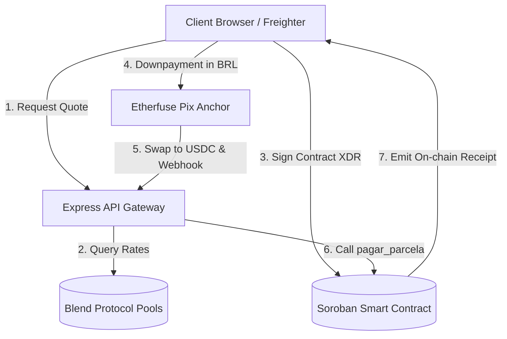

# SyloPay — System Context & Architecture

SyloPay is a next-generation decentralized Buy Now, Pay Later (BNPL) platform built on the **Stellar Blockchain** and **Soroban Smart Contracts**. It provides consumers with dynamic-rate installment plans settled in USDC and BRL (via simulated Pix on-ramp/off-ramp anchors).

---

## 🏗 System Architecture Flow

The diagram below outlines the interactions between the client wallet, backend gateway, local state, and the Stellar Testnet ledger.

---

## 🗂 Core Component Breakdown

### 1. Frontend (`/frontend`)
A premium, highly-responsive Single Page Application (SPA) built using **React + Vite + TypeScript** and styled with **TailwindCSS** and **shadcn/ui**.

*   **Dynamic Checkout Pipeline (`/src/pages`)**:
    *   `CheckoutPage.tsx`: Product selection and initial customer billing details.
    *   `QuotationPage.tsx`: Interactive pricing calculator visualizing APR savings vs traditional credit cards.
    *   `ContractPage.tsx`: Contract creation, dynamic pool rate loading, and Freighter connection.
    *   `ProcessingPage.tsx`: Webhook orchestration for Pix downpayments and Freighter XDR signing hooks.
    *   `DashboardPage.tsx`: Active installment list with direct on-chain USDC payment options.
    *   `DemoWalkthroughPage.tsx`: A self-contained, high-fidelity MVP simulator designed for resilient demonstration recordings.
*   **Global Context (`/src/hooks/useBNPL`)**: Manages step progress, customer data, selected product details, and payment histories seamlessly.
*   **API Interoperability (`/src/services/api.ts`)**: Structured Axios wrapper with robust interception and error handling for connection to the backend and Stellar Horizon.

---

### 2. Backend Gateway (`/backend-cpanel`)
An **Express + TypeScript** server acting as a gateway and transaction builder between the frontend application, the Stellar Network, and third-party APIs.

*   **Execution Modes**:
    *   `app-hybrid.ts` (Recommended): Operates on the live Stellar Horizon Testnet. Dynamically builds on-chain payment structures, validates balances, and funding using custom HTTP fetch operations (minimizing client-side WebAssembly size).
    *   `app-lite.ts`: Sandbox mode utilizing fully-simulated in-memory states to support offline or rapid testing configurations.
*   **Key Features**:
    *   **Trustline Builder**: Seamlessly configures USDC asset trustlines on the fly.
    *   **Account Validator**: Checks wallet balances and activates accounts dynamically using Horizon and Friendbot.
    *   **Rate Limiters**: Prevents SyloPay service abuse via IP-based rate limiting on sensitive transaction preparation routes.

---

### 3. Soroban Smart Contracts (`/contracts/sylopay_bnpl`)
Written in **Rust**, the smart contracts govern the credit agreement, payment enforcement, and merchant settlement.

*   **Key Operations**:
    *   `criar_contrato`: Locks the credit terms (Total Amount, Installment Count, Client and Merchant Keys) directly into the Stellar ledger.
    *   `pagar_parcela`: Direct or webhook-backed USDC call verifying payment against the installment schedules and updating payment statuses on-chain.
    *   `listar_contratos`: Queries active BNPL agreements associated with any client public key.

---

## 🌐 Protocol & Gateway Integrations

| Protocol / Gateway | Purpose | Tech Implementation |
| :--- | :--- | :--- |
| **Blend Protocol** | Dynamic credit APR calculation | Integrated into the Pricing Service to fetch real-time borrower and supplier pool utilization rates. |
| **Etherfuse Sandbox** | BRL-to-USDC conversion | Simulated Webhook trigger translating traditional Brazilian Pix payments into immediate on-chain USDC settlements. |
| **Protocol x402** | Web Monetization & Routing | Native HTTP 402 payment pointer integration allowing merchant platforms to query dynamic billing states interoperably. |

---

## 🔑 Key Deployment Details
*   **Horizon Testnet Endpoint**: `https://horizon-testnet.stellar.org`
*   **Standard USDC Contract (Testnet)**: `GBBD47IF6LWK7P7MDEVSCWR7DPUWV3NY3DTQEVFL4NAT4AQH3ZLLFLA5`
*   **Soroban Contract ID**: `CBY3H6BBUJ64H3QGSDMEQVZU3GKXV4WRE7V7X62PUFXNWYAHI4CCWTXH`
