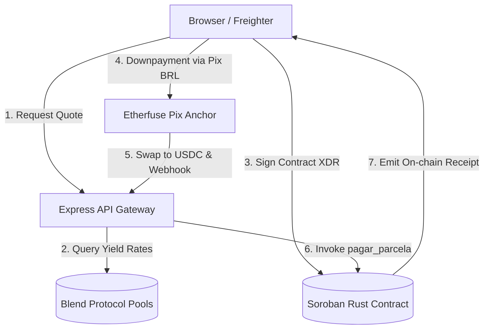

# SyloPay — System Context & Architecture

SyloPay is a **decentralized Buy Now, Pay Later (BNPL) protocol** built on the **Stellar** blockchain using **Soroban Smart Contracts**. It enables e-commerce merchants to offer flexible, transparent installment plans to customers while receiving the full transaction amount instantly. The ecosystem unifies the financial ledger in USDC, with seamless BRL on-ramping via sandboxed Pix API gateways.

---

## 🏗 System Architecture Flow

The following diagram illustrates how the Customer, Freighter wallet, Gateway backend, and Stellar Horizon networks interact:



---

## 🗂 Workspace Layout

```
sylopay/
├── CONTEXT.md                   # This detailed system context & architecture specification
├── README.md                    # Installation manual and developer quickstart guide
├── .env.example                 # Standard environment profile template
├── package.json                 # Global automation task scripts
│
├── docs/                        # Docusaurus Technical Specification Portal (React + TS)
│
├── scripts/                     # Node.js CLI dev-ops utilities
│   ├── setup-stellar.js         # Geração de keypairs Stellar e Friendbot funding
│   ├── register-webhook.js      # Registering and configuring Etherfuse HMAC webhooks
│   └── test-webhook.js          # Local simulated Pix payment webhook dispatcher
│
├── frontend/                    # SPA React + Vite + TypeScript (port 3001)
│   ├── public/                  # High-res item catalog images and branding logos
│   └── src/
│       ├── App.tsx              # Router entrypoint
│       ├── hooks/useBNPL.tsx    # Hook and global context coordinating checkout state
│       ├── pages/               # Multi-step views (Checkout, Quotation, Contract, Dashboard)
│       ├── components/          # Reusable UI primitives
│       └── services/            # Axios API wrappers and DeFi fetchers
│
├── backend-cpanel/              # Express API Server gateway (port 3000)
│   └── src/
│       ├── app-hybrid.ts        # Production endpoint integrated with Soroban RPC and Horizon
│       ├── app-lite.ts          # Offline sandbox demo server with mocked data
│       ├── swagger.ts           # OpenAPI/Swagger configurations
│       └── services/
│           ├── storage.ts       # Simple JSON database storage (contracts.json)
│           ├── soroban.ts       # Stellar Soroban RPC client methods
│           └── etherfuse.ts     # FX conversions and Pix sandboxed orders
│
└── contracts/
    └── sylopay_bnpl/            # Soroban Smart Contract source code in Rust
        ├── Cargo.toml
        ├── src/
        │   ├── lib.rs           # Modular entrypoint containing clean #[contractimpl] functions
        │   ├── types.rs         # Storage keys, structs, and enums #[contracttype]
        │   ├── utils.rs         # Shared helper functions and unique ID generators
        │   └── test.rs          # Isolated unit test suite
        └── docs/                # Interactive mdBook digital guide
```

---

## 🛠 Tech Stack

*   **Frontend**: React 18, Vite 5, TypeScript 5, Tailwind CSS 3.
*   **Backend**: Node.js, Express 4, TypeScript 5, OpenAPI / Swagger.
*   **Smart Contracts**: Rust (`soroban-sdk v22`), Cargo.
*   **Stablecoin**: USDC (Testnet).
*   **On-Ramp Anchor (Pix)**: Etherfuse Sandbox FX API + HMAC secure cryptographic webhooks.
*   **Web3 Wallet**: `@stellar/freighter-api` (Freighter Wallet).

---

## 📝 Soroban Smart Contract Specifications

The SyloPay BNPL on-chain core is written in Rust, refactored into a comment-free, modular architecture designed for security and gas optimization.

*   **Contract ID (Testnet)**: `CBY3H6BBUJ64H3QGSDMEQVZU3GKXV4WRE7V7X62PUFXNWYAHI4CCWTXH`
*   **USDC Token Address (Testnet)**: `GBBD47IF6LWK7P7MDEVSCWR7DPUWV3NY3DTQEVFL4NAT4AQH3ZLLFLA5`

### Exported Functions (`lib.rs`)

#### State-Mutating Endpoints
*   `initialize(env: Env, admin: Address)`: Establishes contract administrator and boots the counter to zero.
*   `criar_contrato(env: Env, merchant: Address, cliente: Address, valor_total: i128, num_parcelas: u32) -> String`: Registers a new structured BNPL contract on-chain. Staggers 30-day billing cycles, mapping ledger records into persistent storage.
*   `pagar_parcela(env: Env, contrato_id: String, numero_parcela: u32, tx_hash: String)`: Confirms a single installment settlement, writing the transaction hash onto the ledger record.
*   `marcar_inadimplente(env: Env, contrato_id: String)`: Allows only the administrator account to flag delinquent agreements with overdue installments.

#### Read-Only Endpoints
*   `status_contrato(env: Env, contrato_id: String) -> ContratoBNPL`: Returns structural ledger data for the specified contract ID.
*   `listar_contratos_cliente(env: Env, cliente: Address) -> Vec<String>`: Returns a vector of contract IDs created by the user.
*   `obter_admin(env: Env) -> Address`: Returns the active administrator address.
*   `total_contratos(env: Env) -> u32`: Returns total registered contract counters.

---

## 📡 Gateway API Server Endpoints (backend-cpanel)

### Infrastructure & Stellar
*   `GET /health`: Operational health status.
*   `GET /api/stellar/health`: Active Horizon testnet node synchronization checks.
*   `POST /api/stellar/create-account`: Auto-funds a simulated Testnet keypair using Stellar Friendbot.
*   `GET /api/stellar/account/:publicKey`: Queries active token balances (XLM/USDC).
*   `POST /api/stellar/create-trustline`: Configures trustlines dynamically for USDC.

### FX Quotes & Orders (Etherfuse)
*   `POST /api/etherfuse/quote-onramp`: Fetches conversion fees and Pix on-ramp quotes.
*   `POST /api/etherfuse/order`: Dispatches sandboxed Pix order keys and Pix QR Codes.
*   `GET /api/etherfuse/order/:id`: Queries transaction progress on the sandbox anchor.

### Soroban Ledger Procedures
*   `POST /api/soroban/prepare-contract`: Compiles unsigned transaction envelopes (XDR) for Freighter.
*   `POST /api/soroban/submit-contract`: Submits Freighter signed envelopes to Soroban.
*   `POST /api/soroban/prepare-payment`: Generates unsigned payment envelopes for direct USDC settlements.
*   `POST /api/soroban/submit-transaction`: Publishes USDC billing payments to Horizon Testnet.
*   `GET /api/soroban/contracts/cliente/:publicKey`: Aggregates active contracts from local memory and on-chain Soroban.

### HMAC Cryptographic Webhooks
*   `POST /webhook/etherfuse`: Validates sandbox Pix deposits via HMAC signatures, executes off-chain to on-chain conversions, and triggers the `pagar_parcela` Soroban contract invocation on-chain automatically.

---

## 🎯 Integrations & Advanced Protocols

1.  **DeFi Integrations**: Queries Blend Protocol pools to demonstrate competitive credit APR vs traditional credit cards.
2.  **HTTP 402 / x402 Specification**: Supports the Web Monetization standard. External marketplaces can resolve merchant vaults dynamically via standardized HTTP headers.
3.  **Sandbox Demo Environments**: An integrated `/demo` interface which simulates the full checkout workflow seamlessly.
