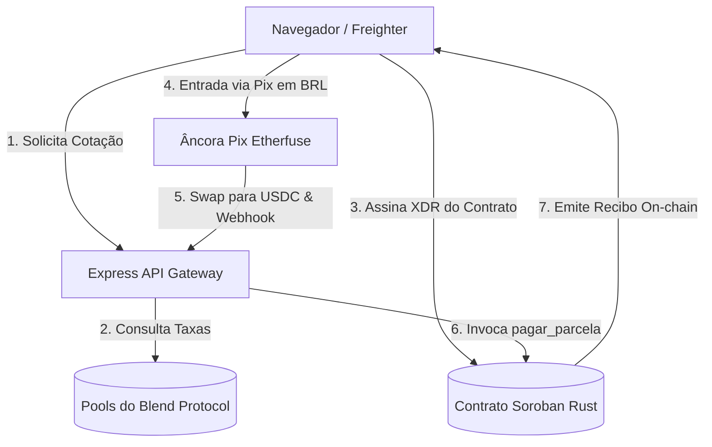

# General System Architecture

The **SyloPay Buy Now, Pay Later** ecosystem integrates the following key architectural layers:

---

## 🏛️ Ecosystem Overview

---

## 📡 Gateway Server (Express CPanel)

The intermediate Express API acts as the bridge connecting the client to the blockchain and anchor rampa:

*   **Friendbot Creation**: Automatic funding of newly created Testnet wallets.
*   **Etherfuse SandBox Integration**: On-ramp and webhook listener that intercepts PIX payments, swaps BRL to USDC, and triggers on-chain payments.
*   **Soroban RPC Interceptor**: Encapsulates contract prepare-and-submit transactions.

---

## 🎯 Integrations

1.  **Blend DeFi Protocol**: Queries rates on-chain to display competitive installment APR.
2.  **x402 Protocol**: Native Payment Pointer integration for automated invoices.
