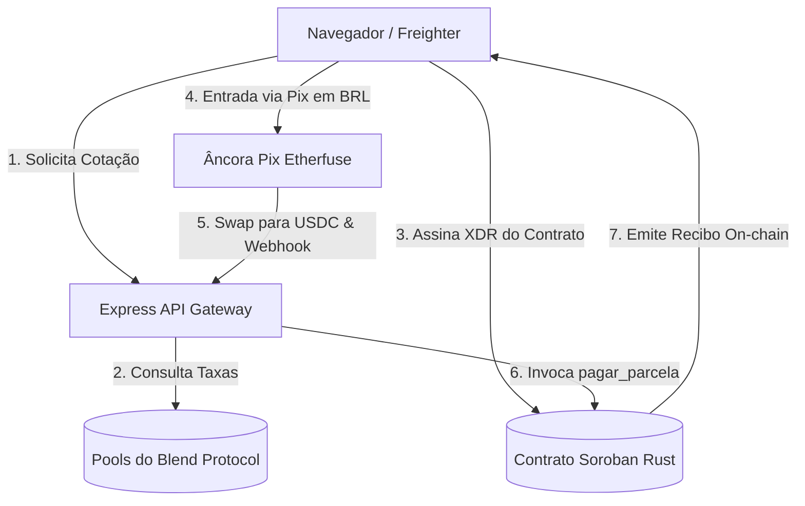

# SyloPay Spec Portal

Welcome to the **SyloPay Technical Specification Portal**. 

This portal contains the complete specifications, architecture flows, design system details, and blockchain logic for the SyloPay Buy Now, Pay Later ecosystem.

---

## 🗺️ Explore the Technical Specs

Use the left sidebar navigation menu to browse:

*   **[Stellar Smart Contracts](./smart_contracts.md)**: Specifications of the modular Rust-based Soroban smart contracts.
*   **[Frontend UI Components](./frontend_ui.md)**: Deep dive into the React pages, global states (`useBNPL`), and Amber design systems.
*   **[General Architecture](./architecture.md)**: High-level overview of the DeFi rates, anchors, and double-entry on-chain storage.
